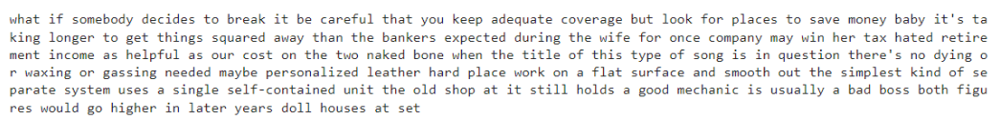

 <H3>NAME: SRIJITH R</H3>
<H3>REGISTER NO: 212221240054</H3>
<H3>EX. NO.8</H3>
<H3>DATE:25/04/2024</H3>
<H1 ALIGN =CENTER>Implementation of Speech Recognition</H1>
<H3>Aim:</H3> 
 To implement the conversion of live speech to text.<BR>
<h3>Algorithm:</h3>
Step 1: Import the speech_recognition library<Br>
Step 2: Initialize the Recognizer<Br>
Step 3: Create an instance of the Recognizer class, which will be used for recognizing speech.<Br>
Step 4: Set the duration for audio capture<Br>
Step 5: Define a variable to specify the duration (in seconds) for which the program will capture audio from the microphone.<Br>
Step 6: Display a message in the console to prompt the user to speak.<Br>
Step 7: Capture audio from the default microphone<Br>
Step 9: Use the default microphone as the audio source.<Br>
Step 10: Record audio for the specified duration using the Recognizer instance.<Br>
Step 11: Perform speech recognition with exceptional handling:<Br>
•	Attempt to recognize speech from the captured audio using the Google Speech Recognition service.<Br>
•	If successful, print the recognized text.<Br>
•	Handle specific exceptions: If the recognition result is unknown or if there is an issue with the request to the Google Speech Recognition service, print corresponding error messages.<Br>
•	A generic exception block captures any other unexpected errors.<Br>
<H3>Program:</H3>

```python
import speech_recognition as sr

# Assign a string variable "file" with the name of the audio file that you want to transcribe.
file = "audio.wav"

# Create an instance of the Recognizer class called "r".
r = sr.Recognizer()

# Use the AudioFile() method of sr to create an AudioFile object with the audio file name passed as an argument.
with sr.AudioFile(file) as source:
    audio = r.record(source)

# Use the recognize_google() method of r to transcribe the audio data stored in the "audio" variable.
try:
    text = r.recognize_google(audio)
except sr.UnknownValueError:
    print("Not clear")
except sr.RequestError as e:
    print("Couldn't get results from Google Speech Recognition service; {0}".format(e))

# Print the text in the next lines.
for line in text.splitlines():
    print(line)
```
<H3> Output:</H3>



<H3> Result:</H3>

Thus, we have implemented a program that will transcribe the audio file in the file variable and print the transcribed text on the console, one line at a time.
